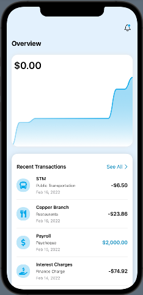
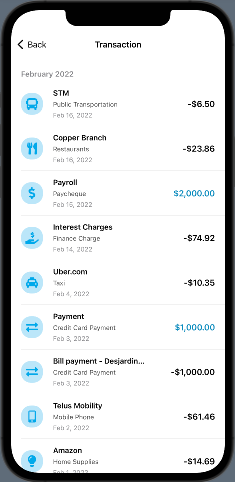
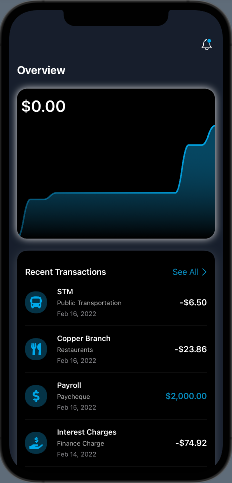
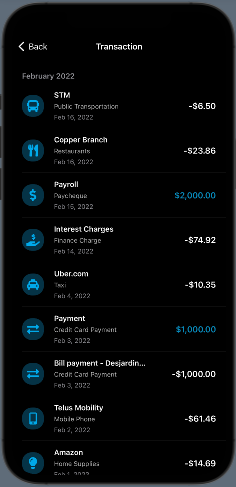
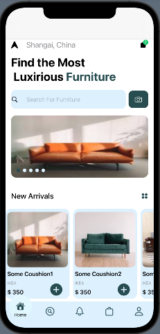
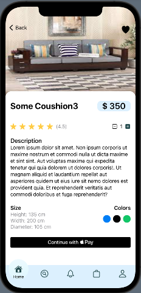
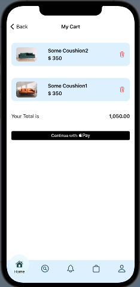

# IOS Projects

This project contains my opensource projects build using swift ios.

The list of projects are

- [x] Bullseye Game Swift UI
- [x] Expence Tracker application
- [x] Furniture Ecommerce application
- [x] Checklist App Swift UI
- [ ] Bullseye Game UI kit
- [x] Expense Tracker Swift UI
- [x] Ios Academy Application

### Screenshots

- 1 **Bullseye**

|
|

- 2 **Expense Tracker**

|
|
|
|

- 3 **Furniture Ecommerce**

|
|
|
|

- 4 **Checklist**

|
|
|

- 5 **IOS Academy**

|
