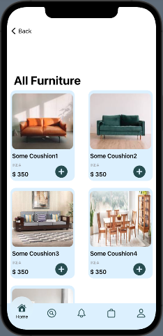

# IOS Projects

This project contains my opensource projects build using swift ios.

The list of projects are

- [x] Bullseye Game Swift UI
- [x] Expence Tracker application
- [x] Furniture Ecommerce application
- [x] Checklist App Swift UI
- [ ] Bullseye Game UI kit
- [x] Expense Tracker Swift UI
- [x] Ios Academy Application
- [x] Map bookmarkapp

### Screenshots

- **Map bookmark**

- **Bullseye**

|
|

- **Expense Tracker**

|
|
|
|

- **Furniture Ecommerce**

|
|
|
|

- **Checklist**

|
|
|

- **IOS Academy**

|
