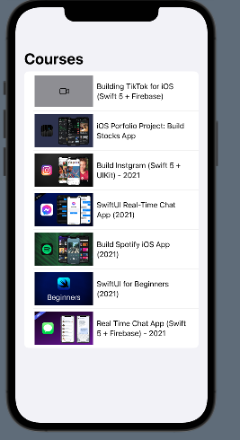

# IOS Projects

This project contains my opensource projects build using swift ios.

The list of projects are -[x] Bullseye Game Swift UI -[x] Checklist App Swift UI -[ ] Bullseye Game UI kit -[x] Expense Tracker Swift UI -[x] Ios Academy Application -[ ] Expence Tracker application

### Screenshots

- 1 **Bullseye**

|
|

- 2 **Checklist**

|
|
|

- 3 **IOS Academy**

|

- 4 **Expense Tracker**

|
|
|
|
